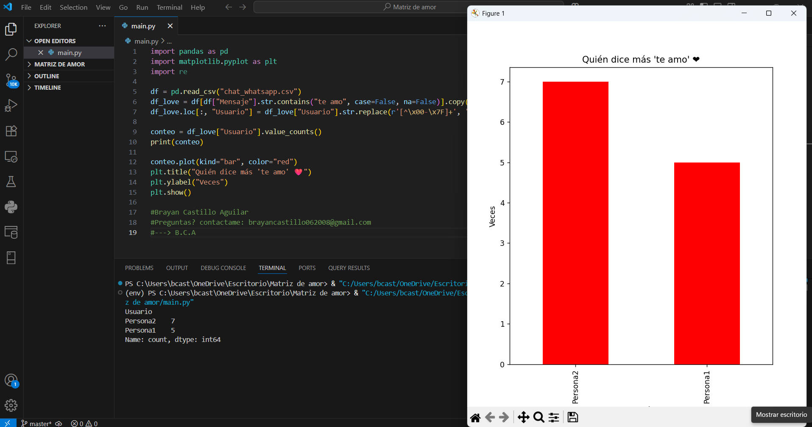

# Matriz-de-amor ❤️

Este proyecto analiza los mensajes de WhatsApp y crea una “matriz de amor”, mostrando quién dice más “te amo”.

## Cómo usar

1. Coloca tu archivo `chat_whatsapp.csv` en la carpeta del proyecto.
2. Crea un entorno virtual:
   ```bash
   python -m venv env
3. Activa el entorno virtual:

(Windows PowerShell):
   ```bash
   .\env\Scripts\activate
   ```
(Linux/macOS):
   ```bash 
   source env/bin/activate
   ```
4. Instala las dependencias:
   ```bash
   pip install -r requirements.txt
   ```
5. Ejecuta el script principal:
   ```bash
   python main.py
   ```
## Ejemplo


